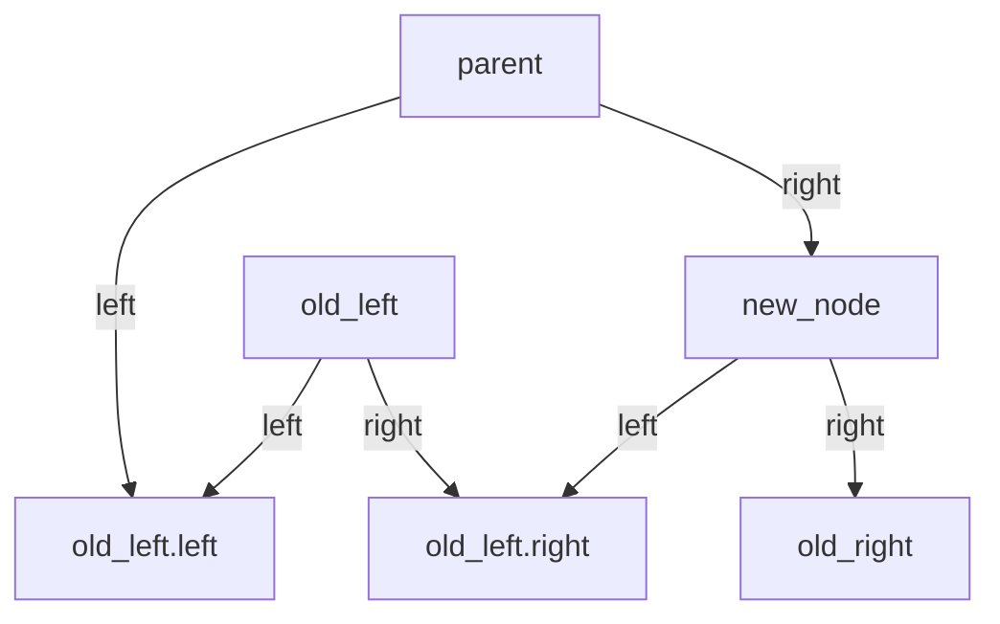

# PA3 - Syntax Trees

Students must re-register into groups, with a maximum of three students per group. A minimum of two students per group is required unless an exemption is granted by the instructor. Exempted students must still register in a single-person group. Predefined groups are named PA3_X, where X is a number; students should register only in these groups and not create new ones.

There are no restrictions on the version of C++ used. All data structures and features from the standard library are permitted. However, usage is limited to the standard library and g++; external libraries such as Boost are not allowed.

## Handing in

- Hand in a single ZIP, including:
	- All code files (.cpp and .h)
	- A Makefile to compile and run both versions of your program (the two versions can be in separate files, but they do not have to be).
	- README.md (or README.txt), in which is:
		- Instructions for compiling and running the program in the terminal, including explanations for executing each of the two parts.
		- A description of any additional features implemented beyond the base version, if applicable.
		- An explanation of the format used to store the Abstract Syntax Tree (AST) for both reading and writing operations.
		- Any additional comments should be included here rather than in the Canvas comments section.

This assignment comes in two parts.
In the first part, your program should take in an expression and output a syntax tree representing that expression.
In the second part, your program should read a syntax tree output by the first part and evaluate it.
The format for storing the syntax tree is at the student’s discretion. However, the program must be capable of writing and reading files containing these trees.

## Base version: 50%

Your program should be able to read simple expressions containing positive integers, addition, multiplication, and parentheses. It should respect the order of operations.

### The first part

The first part should be callable with two command-line arguments, the first being the name of the file to write the AST to, and the second being the name of the file to read the expression from. If the second argument is missing, it should read from `stdin` instead.

For example, consider the expression “`{cpp} 2+7*(1+3+4*2)`”.
- Evaluation can begin by simplifying either `{cpp} 1+3` to `{cpp} 4` or `{cpp} 4*2` to `{cpp} 8`.
- Subsequently, `{cpp} 4+8` is simplified to `{cpp} 12`, and the parentheses are removed.
- Next, `{cpp} 7 * 12` is evaluated, followed by the final addition.
- This process, when represented as a tree, yields the following structure:

This structure represents the expected output tree for the first part, given the input above.
- You can store this as a literal tree, and you can store it as an array of parent indices/pointers.
- The method of storing this structure in the file is at the student’s discretion, provided the chosen approach is documented.

### The second part

The second half of the program then takes one command-line argument, the filename to read the AST from.
It should then simply evaluate the tree and output a single number.
You may assume that it will not be tested with anything that would overflow a signed 64-bit integer.
Therefore, the built-in string-to-int methods in C++ will suffice.
We will not test your program on large expressions in the base version.
The recommended approach is to identify the first operation to split on and repeat this process as needed.

It is recommended to implement this process recursively, as it simplifies the overall implementation.
If your input string is `buf` and you implement the AST as literal nodes with pointers to each other, the main parsing function in your program might be something like “`{cpp} Node parse(string &s, int left, int right)`”.
Calling `{cpp} parse(s, 0, 10)` would then parse the first 11 characters of parse.
If you decide to split on an operator at index 7, you could then evaluate what is to the left and right of it with `{cpp} parse(s, 0, 6)` and `{cpp} parse(8, 10)`.
This paragraph provides a proposed implementation approach.

For those who want to read up on technical details of this kind of parsing can look up “Operator Precedence Parsing”.

## Additional Features (50%)

The following is a list of additional features that may be implemented to achieve a score above the base version’s 50%. The maximum grade attainable is 10. All additional features implemented must be listed in the README.

- **Whitespace insensitive (5%):** Your implementation can handle extra spaces, newlines, tabs, etc. in the input files.
- **Modern C++ Tree (5%):** Your AST(Abstract Syntax Tree) is implemented as a literal tree, but uses no `{cpp} new`/`{cpp} delete` functionality (consider smart pointers).
	- “Literal tree” means you have a node class and they point to each other, meaning you could do things like splice together trees in $O(1)$ or $O(\log(n)$ and so forth.
	- This does not mean the AST file has to be written out as a tree, just the data structure in the program itself.
- **Variables (15%):** The input can contain variables (tokens consisting of lower-case ASCII characters).
	- These have to become part of the AST (so a leaf could contain “`{cpp} x`” instead of say “`{cpp} 4`”).
	- When evaluating the AST, the program has to read from a second file that gives values to all variables (which becomes another command-line argument).
	- Each line of that input file contains one variable value, given in the format “`{cpp} x=7`”.
- **AST (Abstract Syntax Tree) optimisations (~10%):** This is only relevant if you have already implemented variables.
	- The first part of your program trims redundant parts of the tree and simplifies it.
	- Exactly what this means is somewhat open to interpretation.
	- It can mean evaluating constants and simplifying them, replacing things like `{cpp} 0*x` by simply `{cpp} 0`, even though `{cpp} x` is a variable and so on.
	- Detail what optimisations you make in the README.
	- If you make only very simple optimisations like replacing `{cpp} 0*x` by `{cpp} 0` and nothing else, this is less than 10%.
	- If you do more advanced simplifications than mentioned here, such as multiplying inside parentheses, dropping unnecessary parentheses, and more, it can be more than 10%.
- **Extra operations (10%):** Your program supports binary minus, binary division (rounds down like in C++), and unary minus.
	- So, for example, “`{cpp} (-3-12)/5`” should work.
- **High speed (15%):** Both program parts run efficiently and can handle input sizes of above a million characters in around a second or so.
	- The slow part that causes quadratic behaviour in the simpler implementation is scanning from left to right in linear time each time you want to parse the substring `{cpp} l` to `{cpp} r`.
	- So you have to be able to find what to split on quickly, and find the matching closing paren to an opening paren quickly, and so forth.
	- Something like using sets of indices with `{cpp} lower_bound` might be useful.
- **Error handling (~10%):** We have not covered error handling much yet, but if you gracefully catch some common errors, this can be 10% extra.
	- Things like “division by zero”, “missing variable in file”, “overflow”, “file does not exist with that name”, etc.
	- If you implement all these error handling cases, it is around 10%.
	- If you implement less, less; if you implement more, possibly more.

If you, for example, implement the program with variables, whitespace insensitivity, and it runs in linear time, then your total grade is 50% + 15% + 5% + 15% = 85%.

Students with ideas for additional features not listed here are encouraged to contact the instructor via Piazza, Discord, or email for possible inclusion. Suggestions are welcome.

